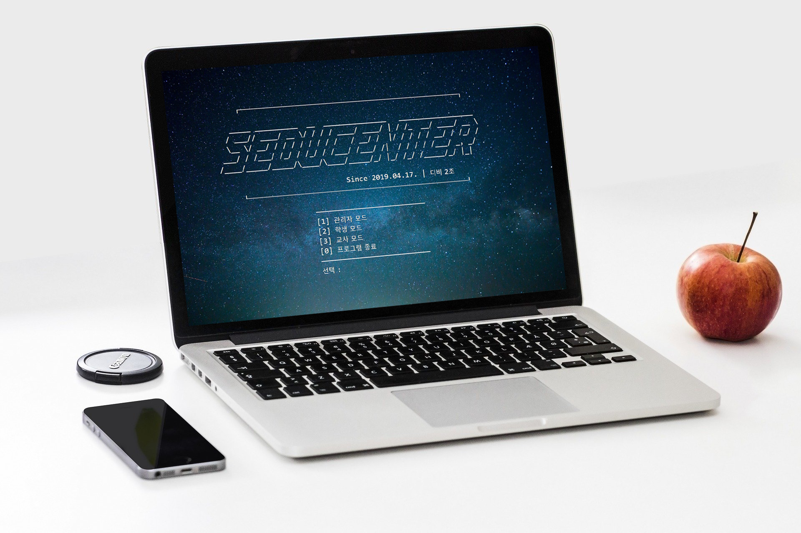
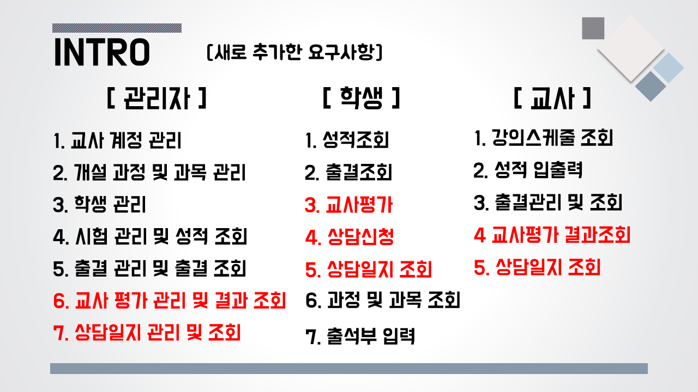
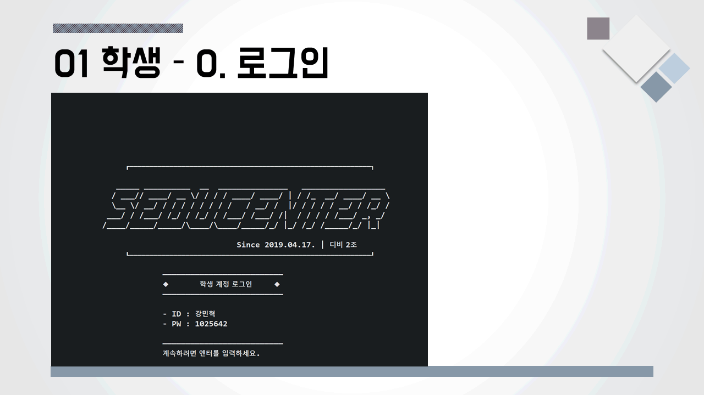
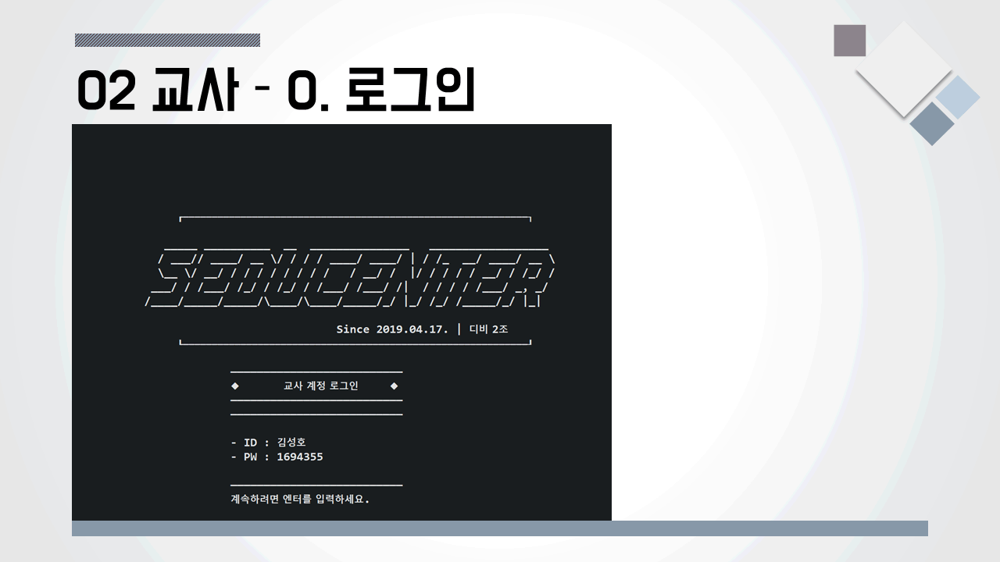
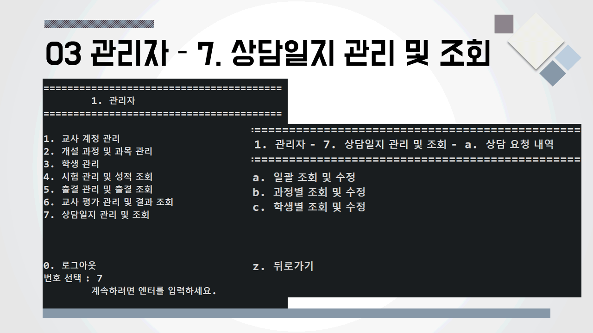

# SEDU Center

### 👋 Introduction

<table>
    <tr>
        <th>프로젝트명</th>
        <th>SEDU Center</th>
        <th>개발 기간</th>
        <th>2019.04.05. ~ 2019.04.19.  (일 4시간, 총 15일)</th>
    </tr>
    <tr>
        <th>프로젝트 성격</th>
        <th>세미 프로젝트</th>
        <th>개발 인원</th>
        <th>팀 / 6명 
          (<a href="https://github.com/chanmi-kim">KCM</a>,
          <a href="https://github.com/SeHoonBae">BSH</a>,
          <a href="https://github.com/daahyunee">LDH</a>,
          <a href="https://github.com/AlfredCho">JSB</a>,
          <a href="https://github.com/jubi93">YJY</a>,
          <a href="https://github.com/popcon4199">CYN</a>)
      </th>
    </tr>
      <tr>
        <th>프로젝트 개요</th>
        <th>SW 교육센터 운영 프로그램</th>
        <th>개발 환경</th>
        <th>Eclipse JEE, Oracle DB, Java(JDK1.8)</th>
    </tr>
        <tr>
        <th>주요 기술</th>
        <th>Java, SQL</th>
        <th>비고</th>
        <th> </th>
    </tr>
</table>

### 📼 Appearance

관계형 데이터베이스 기반의 SW 교육센터 운영 프로그램입니다.

<table>
    <tr>
        <th colspan="3">Task</th>
    </tr>
    <tr>
        <th colspan="3"></th>
    </tr>
    <tr>
       <th>Student</th>
       <th>Teacher</th>
       <th>Admin</th>
    </tr>
    <tr>
        <th></th>
        <th></th>
        <th></th>
    </tr>
</table>

### 📑 Role & Member

<table>
    <tr>
        <th>업무/구성원</th>
        <th><a href="https://github.com/daahyunee">LDH</a></th>
        <th><a href="https://github.com/chanmi-kim">KCM</a></th>
        <th><a href="https://github.com/SeHoonBae">BSH</a></th>
        <th><a href="https://github.com/AlfredCho">JSB</a></th>
        <th><a href="https://github.com/jubi93">YJY</a></th>
        <th><a href="https://github.com/popcon4199">CYN</a></th>
    </tr>
    <tr>
        <th>프로젝트 기획</th>
        <th>개요작성</th>
        <th colspan="5">회의, 의견제안</th>
    </tr>
    <tr>
        <th>요구분석</th>
        <th colspan="6">회의, 의견제안, 문서작성</th>
    </tr>
    <tr>
        <th>데이터설계</th>
        <th colspan="6">회의, 의견제안, 문서작성</th>
    </tr>
    <tr>
        <th>기능명세서</th>
        <th>문서정리</th>
        <th colspan="5">문서작성</th>
    </tr>
    <tr>
        <th>화면설계</th>
        <th>학생</th>
        <th>교사</th>
        <th>관리자</th>
        <th>교사</th>
        <th colspan="2">관리자</th>
    </tr>
    <tr>
        <th>소스(코딩)</th>
        <th>학생 부분  개발 및 화면 설계</th>
        <th>교사 부분  개발 및 화면 설계, 교사  소스 취합</th>
        <th>관리자 부분  개발, 및 화면 설계, 관리자  소스 취합</th>
        <th>교사 부분 개발,  및 화면설계,  전체 소스 취합</th>
        <th>관리자 부분  개발, 및  화면설계</th>
        <th>관리자 부분  개발</th>
    </tr>
    <tr>
        <th>발표자료</th>
        <th>발표보조</th>
        <th>발표 및  자료작성</th>
        <th colspan="4">의견제안, 화면캡쳐</th>
    </tr>
    <tr>
        <th>역할</th>
        <th>학생 부분  개발,  문서정리,  의견제안</th>
        <th>교사 부분  개발,  소스취합,  발표</th>
        <th>관리자 부분  개발,  소스취합,  버그수정,  발표보조</th>
        <th>교사 부분  개발,  소스취합,  문서정리,  의견제안</th>
        <th>관리자 부분  개발,  소스취합,  문서작성,  의견제안</th>
        <th>관리자 부분  개발,  문서작성</th>
    </tr>
</table>
